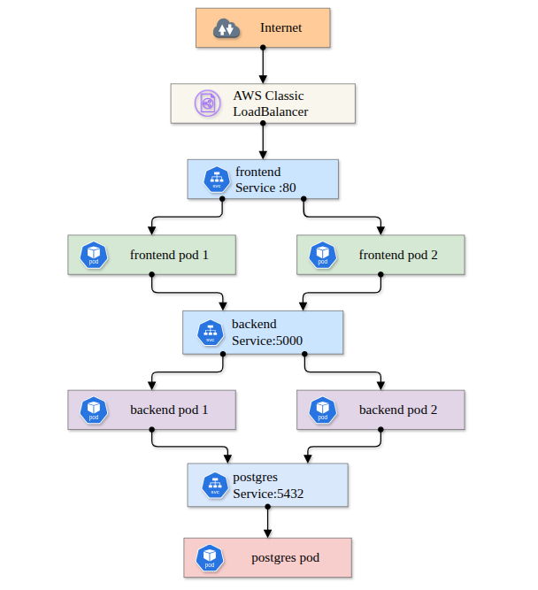

# Full-Stack Application Deployment on Amazon EKS

This repository contains the configuration files and step-by-step instructions for deploying a production-ready, full-stack application (React Frontend, Node.js Backend, and PostgreSQL Database) on Amazon Elastic Kubernetes Service (EKS).



## 🏗️ Architecture Overview

- **Frontend**: React application served via Nginx.
- **Backend**: Node.js REST API.
- **Database**: PostgreSQL (deployed via Helm for development; Amazon RDS recommended for production).
- **Infrastructure**: Amazon EKS (Managed Kubernetes), Amazon ECR (Container Registry), and AWS Application Load Balancer (ALB) for ingress routing.

---

## 📋 Prerequisites

Ensure the following tools are installed and configured on your local machine:

1. **AWS CLI**: Configured with `aws configure` (requires permissions for EKS, EC2, ECR, IAM, and VPC).
2. **eksctl**: The official CLI for creating and managing EKS clusters.
3. **kubectl**: The Kubernetes command-line tool.
4. **Docker**: To build and test container images locally.
5. **Helm**: The package manager for Kubernetes (v3.x).

---

## Step 1.kubectl is the command-line tool for interacting with Kubernetes clusters.

Download kubectl:

```bash
sudo curl --silent --location -o /usr/local/bin/kubectl \
  https://s3.us-west-2.amazonaws.com/amazon-eks/1.22.6/2022-03-09/bin/linux/amd64/kubectl
```

execute command

```bash
sudo chmod +x /usr/local/bin/kubectl
```

Cheack the version

```bash

kubectl version --short --client

```

## Step 2: Install and Set Up eksctl

```bash
curl --silent --location \
  "https://github.com/weaveworks/eksctl/releases/latest/download/eksctl_$(uname -s)_amd64.tar.gz" \
  | tar xz -C /tmp
```

Move the binary to your PATH:

```bash
sudo mv /tmp/eksctl /usr/local/bin
```

Version

```bash
eksctl version
```

## Step 3: Install and Set Up EKSCTL

```bash
curl --silent --location \
  "https://github.com/weaveworks/eksctl/releases/latest/download/eksctl_$(uname -s)_amd64.tar.gz" \
  | tar xz -C /tmp
```

Move the binary

```bash
sudo mv /tmp/eksctl /usr/local/bin
eksctl version
```

## Step 4: Create an Amazon EKS Cluster

```bash
eksctl create cluster \
  --name todo-cluster \
  --version 1.35 \
  --region ap-southeast-1 \
  --zones ap-southeast-1a,ap-southeast-1b \
  --without-nodegroup
```

## Step 5: Create Node Group

```bash

eksctl create nodegroup \
  --cluster=todo-cluster \
  --name=todo-nodes \
  --region=ap-southeast-1 \
  --node-type=t3.medium \
  --managed \
  --nodes=2 \
  --nodes-min=2 \
  --nodes-max=3

```

After the node group is created, update your kubeconfig:

```bash

aws eks update-kubeconfig --name todo-cluster --region ap-southeast-1
```

Get nodes

```bash
kubectl get nodes
```

## Step 6 : clonign the project

```bash
git clone https://github.com/mostafizur-raahman/Deploying-a-Full-Stack-Application-on-EKS.git
cd Deploying-a-Full-Stack-Application-on-EKS
```

```bash
docker compose up -d
```

## Step 7: Log in into your docker and push the images both backend and frontend

```bash
docker build -t <DOCKER_USERNAME>/todo-backend-flask:latest ./backend
docker push <DOCKER_USERNAME>/todo-backend-flask:latest

docker build -t <DOCKER_USERNAME>/todo-frontend-react:latest ./frontend
docker push <DOCKER_USERNAME>/todo-frontend-react:latest
```

## Step 8: Create Kubernetes Namespace

```bash
kubectl create namespace todo-app
```

## Step 9: Apply

```bash
kubectl apply -f k8s/postgres.yaml
kubectl apply -f k8s/backend.yaml
kubectl apply -f k8s/frontend.yaml
```

## Step 10: check the --> Wait for the LoadBalancer to get an external hostname (this takes 2-3 minutes):

```bash
kubectl get svc frontend -n todo-app -w
```

## Once the EXTERNAL-IP column changes from <pending> to a hostname, press Ctrl+C and save it:

```bash
export APP_URL=$(kubectl get svc frontend -n todo-app -o jsonpath='{.status.loadBalancer.ingress[0].hostname}')
echo "Application URL: http://$APP_URL"
```

## Step 11: Verify all pods are running:

```bash
kubectl get pods -n todo-app
```

```bash
NAME                        READY   STATUS    RESTARTS   AGE
backend-xxxxx-xxxxx         1/1     Running   0          10m
backend-xxxxx-xxxxx         1/1     Running   0          10m
frontend-xxxxx-xxxxx        1/1     Running   0          30s
frontend-xxxxx-xxxxx        1/1     Running   0          30s
postgres-xxxxx-xxxxx        1/1     Running   0          2m
```

## Step 12: kubectl get all -n todo-app

```bash
You should see:

5 pods — 1 PostgreSQL + 2 backend + 2 frontend
3 services — postgres (ClusterIP), backend (ClusterIP), frontend (LoadBalancer)
3 deployments — all showing READY


```

## TEST Deployment

```bash
# Health check
curl http://$APP_URL/health

# Create a todo
curl -X POST http://$APP_URL/api/todos \
  -H "Content-Type: application/json" \
  -d '{"title":"Learn Kubernetes"}'

# List todos
curl http://$APP_URL/api/todos
```
